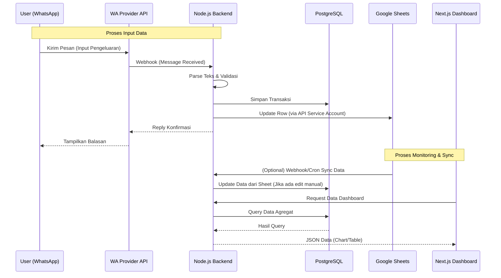
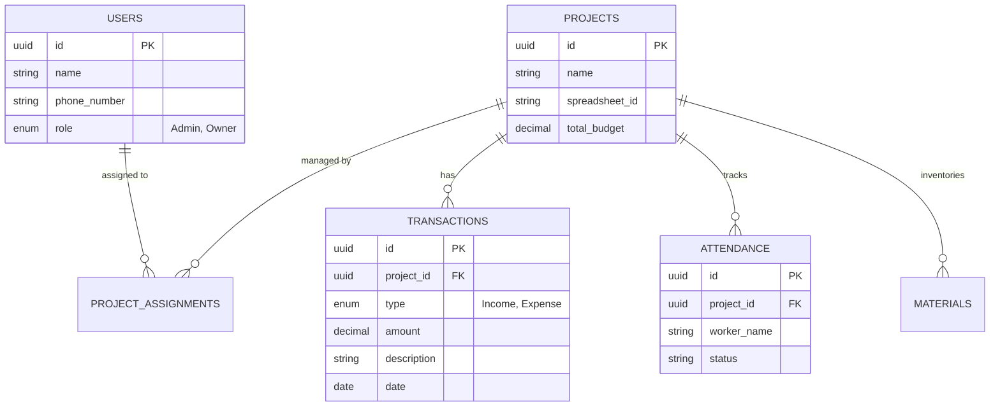

# PRD — Project Requirements Document

## 1. Overview
Proyek konstruksi seringkali mengalami kesulitan dalam pelacakan data lapangan (pengeluaran, progres, absensi) secara *real-time* karena proses input yang rumit. Aplikasi ini bertujuan untuk menyederhanakan proses tersebut dengan menggunakan **WhatsApp** sebagai alat input utama yang familier bagi pekerja lapangan, namun tetap menyediakan **Dashboard Web** yang profesional bagi pemilik proyek (Owner) dan Admin untuk memantau data.

Sistem ini akan terintegrasi penuh dengan **Google Sheets** secara 2 arah, memungkinkan fleksibilitas manipulasi data di spreadsheet sekaligus visualisasi yang rapi di aplikasi. Tujuan utamanya adalah transparansi budget, pemantauan stok material, dan pelacakan progres (Kurva S) secara harian.

## 2. Requirements
*   **Aksesibilitas:** Input data lapangan harus bisa dilakukan melalui WhatsApp tanpa perlu membuka aplikasi web/mobile yang berat.
*   **Integrasi Data:** Sinkronisasi 2 arah antara Database aplikasi dan Google Sheets (menggunakan Google Service Account). Perubahan di satu sisi harus merefleksikan sisi lainnya.
*   **Multi-Proyek:** Sistem harus mampu menangani banyak proyek konstruksi sekaligus dengan pemisahan data yang jelas.
*   **Visualisasi:** Data mentah harus diolah menjadi grafik yang mudah dibaca (Kurva S, Pie Chart Budget) di dashboard.
*   **Peran Pengguna:** Pembedaan akses antara Admin Kantor (Input & Monitor) dan Owner Proyek (Monitor Only).

## 3. Core Features
1.  **WhatsApp Bot Integration**
    *   Input data menggunakan kombinasi Menu/Button (untuk memilih kategori) dan Teks (untuk detail).
    *   Parsing otomatis format teks (Contoh: "pengeluaran semen 100000").
    *   Kategori input: Pengeluaran, Pemasukan, Absensi Pekerja, Stok Material.
2.  **Web Dashboard (Monitoring)**
    *   **Ringkasan Proyek:** Menampilkan *High-level metrics* (Total Budget vs Realisasi).
    *   **Kurva S:** Grafik garis yang membandingkan rencana progres vs realisasi progres di lapangan.
    *   **Stok Material:** Tabel sisa stok material di lapangan.
    *   **Absensi:** Rekap kehadiran pekerja harian.
3.  **Google Sheets Sync Engine**
    *   Setiap proyek memiliki file Google Sheet unik yang terhubung.
    *   Bot WA menulis data ke DB dan Sheet.
    *   Dashboard membaca data dari DB (yang disinkronkan dengan Sheet).
4.  **Manajemen Proyek**
    *   Create, Read, Update, Delete (CRUD) data proyek.
    *   Pengaturan budget awal dan durasi proyek untuk kalkulasi Kurva S.

## 4. User Flow
**Flow 1: Input Data Harian (Admin Kantor/Lapangan)**
1.  User membuka chat WhatsApp bot proyek.
2.  User memilih menu/tombol: "Input Pengeluaran".
3.  Bot meminta detail, User membalas: "Semen 10 sak 500000".
4.  Bot memproses teks, menyimpan ke Database & Google Sheet.
5.  Bot membalas konfirmasi: "Data tersimpan: Semen Rp 500.000".

**Flow 2: Monitoring (Owner Proyek)**
1.  Owner login ke aplikasi web.
2.  Owner memilih proyek yang sedang berjalan dari daftar proyek.
3.  Dashboard menampilkan grafik Kurva S dan sisa budget.
4.  Owner melihat tabel detail untuk memeriksa transaksi mencurigakan.

## 5. Architecture
Aplikasi menggunakan arsitektur *monolith modular* dengan Node.js sebagai backend yang menangani logika bisnis, parsing pesan WA, dan sinkronisasi Google Sheets. Frontend Next.js bertugas menampilkan data visual.

## 6. Database Schema
Database menggunakan PostgreSQL untuk relasi data yang kuat antara proyek, transaksi, dan pengguna.

### Daftar Tabel Utama:
1.  **users**: Menyimpan data login dan nomor WhatsApp user.
    *   `id` (PK), `name`, `phone_number`, `role` (Admin/Owner), `email`.
2.  **projects**: Data master proyek.
    *   `id` (PK), `name`, `spreadsheet_id` (Link ke GSheet), `start_date`, `end_date`, `total_budget`.
3.  **transactions**: Mencatat arus kas (masuk/keluar).
    *   `id` (PK), `project_id` (FK), `type` (expense/income), `category` (material/upah/lainnya), `amount`, `description`, `date`.
4.  **attendance**: Data absensi pekerja.
    *   `id` (PK), `project_id` (FK), `worker_name`, `status` (hadir/sakit/izin), `date`.
5.  **materials**: Stok material proyek.
    *   `id` (PK), `project_id` (FK), `item_name`, `quantity_in`, `quantity_out`, `current_stock`.

## 7. Tech Stack
Berdasarkan input user dan kebutuhan fitur:

*   **Frontend:** **Next.js** (React Framework)
    *   UI Library: **Tailwind CSS** + **shadcn/ui** (untuk komponen Dashboard yang cepat dan rapi).
    *   Charting: **Recharts** (untuk membuat Kurva S dan chart statistik).
*   **Backend:** **Node.js** (Express atau NestJS disarankan untuk struktur yang lebih baik).
*   **Database:** **PostgreSQL**.
    *   ORM: **Prisma** atau **Drizzle ORM** (untuk kemudahan query database).
*   **WhatsApp Integration:**
    *   **Meta Cloud API** (Official) atau layanan pihak ketiga seperti **Twilio** / **Waha (WhatsApp HTTP API)** untuk kemudahan integrasi.
*   **Integration:**
    *   **Google Sheets API** (menggunakan Service Account credentials).
*   **Deployment:** **Vercel** (Frontend & Serverless Functions) atau kombinasi Vercel (Frontend) + Railway/VPS (Backend & DB) jika butuh long-running process untuk bot WA.