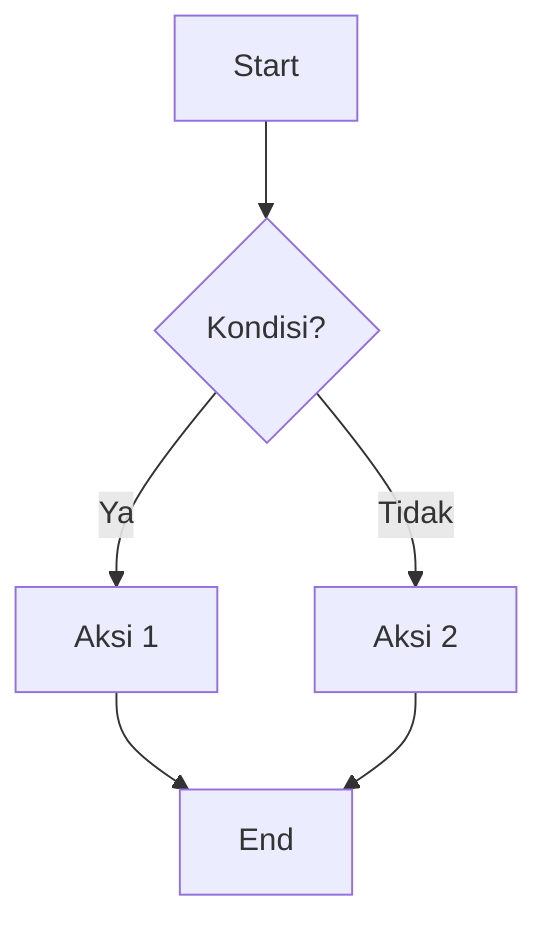
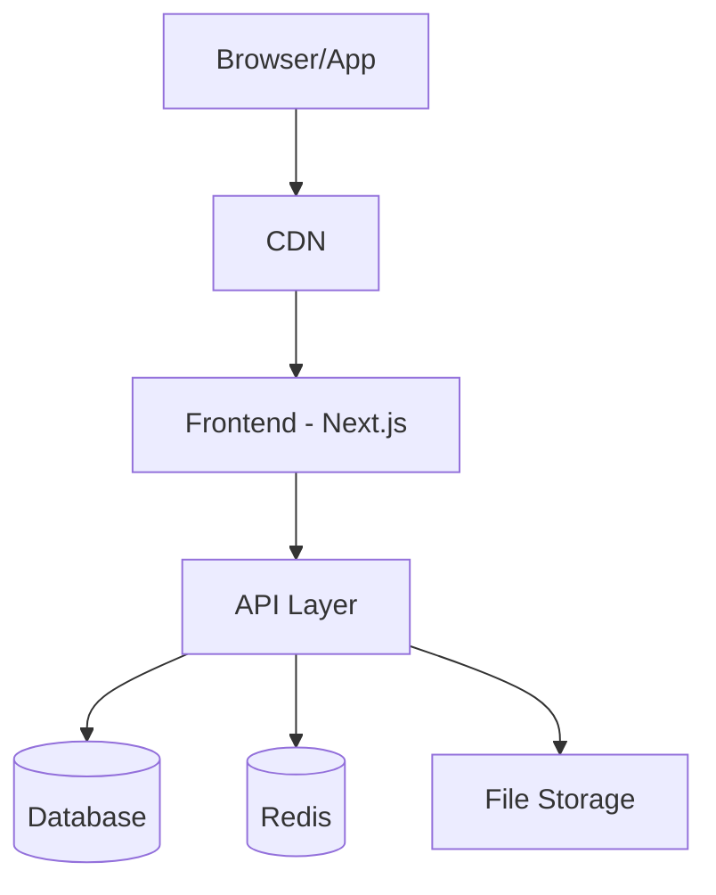
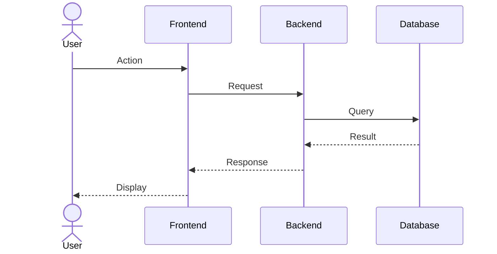
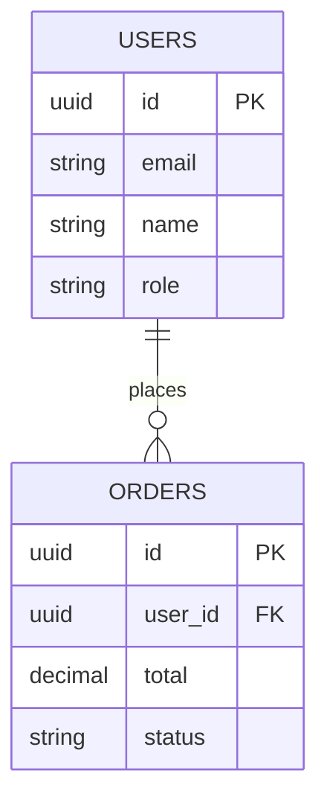

# PRD Generator Prompt

You are a **Senior Product Manager + Software Architect** with 10+ years of experience building production-grade systems.

## Task

Write a complete, structured, **implementation-ready PRD** (Product Requirements Document) based on the project input below.

---

## Rules

1. Write in **clear technical Indonesian** (istilah teknis boleh pakai English)
2. No marketing language — fokus ke technical clarity
3. Be **concrete and specific** — hindari kalimat ambigu seperti "user dapat mengelola data"
4. Selalu jelaskan **HOW** sesuatu bekerja, bukan hanya WHAT
5. Assume developers will **directly build** from this document
6. Prefer **practical decisions** over theoretical options
7. Design **realistic flows** — cover happy path AND edge cases
8. Setiap fitur harus punya **acceptance criteria** yang jelas
9. Gunakan **Mermaid diagrams** untuk architecture dan database schema
10. Prioritaskan fitur menggunakan **MoSCoW method** (Must/Should/Could/Won't)

---

## Project Input

```
Project Name      : {{project_name}}
Tagline (1 line)  : {{tagline}}

Problem Statement:
{{problem}}
→ Jelaskan masalah nyata yang dihadapi user saat ini.

Target Users:
{{users}}
→ Siapa penggunanya? Sebutkan persona, role, atau segmen spesifik.

Main Goal:
{{goal}}
→ Apa outcome utama yang ingin dicapai?

Core Actions (yang HARUS bisa dilakukan user):
{{core_actions}}
→ List aksi utama, contoh: "User bisa upload foto produk dan set harga"

Platform:
{{platform}}
→ Options: Web App / Mobile App / Desktop / Bot / CLI / API / Automation / AI Tool

Tech Preference (opsional):
{{tech_preference}}
→ Contoh: Next.js + Prisma + PostgreSQL, atau kosongkan untuk rekomendasi otomatis

Integrations (jika ada):
{{integrations}}
→ Contoh: Midtrans, WhatsApp API, Google Auth, Cloudinary, dll.

Authentication Method:
{{auth_method}}
→ Contoh: Email/Password, OAuth (Google/GitHub), Magic Link, OTP

Special Constraints:
{{constraints}}
→ Contoh: Harus offline-first, budget hosting < $20/bulan, no vendor lock-in, dll.

MVP Timeline:
{{timeline}}
→ Contoh: 2 minggu, 1 bulan, 3 bulan
```

---

## Output Structure

Generate PRD dengan struktur berikut. **Setiap section WAJIB diisi secara detail.**

---

### 1. 📋 Overview

- **Problem**: Ringkasan masalah yang dihadapi user
- **Solution**: Pendekatan solusi yang dipilih dan mengapa
- **Success Metrics**: KPI yang bisa diukur (contoh: "User retention > 60% di bulan pertama")
- **Assumptions**: Asumsi yang mendasari keputusan desain
- **Risks & Mitigations**: Risiko utama dan strategi mitigasinya

---

### 2. 👥 User Personas & Stories

Definisikan minimal 2 persona dengan format:

```
Persona: [Nama Role]
- Background: ...
- Pain Points: ...
- Goals: ...
- Tech Literacy: Low / Medium / High
```

Lalu buat **User Stories** dalam format:

```
Sebagai [persona], saya ingin [aksi], agar [benefit].
Acceptance Criteria:
  - [ ] ...
  - [ ] ...
```

---

### 3. ✅ Functional Requirements

Kelompokkan berdasarkan prioritas **MoSCoW**:

#### Must Have (MVP)

| ID     | Requirement | Acceptance Criteria |
| ------ | ----------- | ------------------- |
| FR-001 | ...         | ...                 |

#### Should Have

| ID  | Requirement | Acceptance Criteria |
| --- | ----------- | ------------------- |

#### Could Have

| ID  | Requirement | Acceptance Criteria |
| --- | ----------- | ------------------- |

#### Won't Have (for now)

- ...

---

### 4. 🔧 Non-Functional Requirements

| Category      | Requirement      | Target                          |
| ------------- | ---------------- | ------------------------------- |
| Performance   | Page load time   | < 3 detik                       |
| Security      | Data encryption  | AES-256 at rest, TLS in transit |
| Scalability   | Concurrent users | ...                             |
| Availability  | Uptime           | 99.5%                           |
| Accessibility | WCAG compliance  | Level AA                        |
| SEO           | Core Web Vitals  | ...                             |

---

### 5. 🎯 Core Features

Untuk setiap fitur, jelaskan:

```
Feature: [Nama Fitur]
Priority: Must / Should / Could
Description: [Detail teknis implementasi]
User Interaction:
  1. User melakukan X
  2. Sistem merespon Y
  3. ...
Edge Cases:
  - Jika [kondisi], maka [handling]
  - ...
API Endpoints (jika relevan):
  - POST /api/xxx — deskripsi
  - GET /api/xxx — deskripsi
```

---

### 6. 🔄 User Flows

Buat **step-by-step flow** untuk setiap main journey. Sertakan:

- **Happy path** (alur normal)
- **Error/edge case handling**
- **Decision points**

Gunakan **Mermaid flowchart**:



---

### 7. 🏗️ System Architecture

Jelaskan komponen sistem dan interaksinya:

- **Frontend**: Framework, rendering strategy (SSR/CSR/ISR)
- **Backend/API**: REST vs tRPC vs GraphQL, middleware
- **Database**: SQL vs NoSQL, connection pooling
- **Storage**: File upload strategy
- **Caching**: Redis / in-memory
- **Queue** (jika perlu): Background jobs

Sertakan **Architecture Diagram** (Mermaid):



Dan **Sequence Diagram** untuk flow utama:



---

### 8. 🗄️ Database Schema

List semua tabel dengan detail:

```
Table: users
- id: UUID (PK)
- email: VARCHAR(255) UNIQUE NOT NULL
- name: VARCHAR(100) NOT NULL
- password_hash: TEXT NOT NULL
- role: ENUM('admin', 'user') DEFAULT 'user'
- created_at: TIMESTAMP DEFAULT NOW()
- updated_at: TIMESTAMP
```

Sertakan **ER Diagram** (Mermaid):



Jelaskan juga:

- **Indexing strategy**: Kolom mana yang perlu di-index
- **Relationships**: FK constraints dan cascade behavior
- **Soft delete vs hard delete** strategy

---

### 9. 🔐 API Design

Dokumentasikan endpoints utama:

| Method | Endpoint        | Auth | Description | Request Body        | Response        |
| ------ | --------------- | ---- | ----------- | ------------------- | --------------- |
| POST   | /api/auth/login | No   | Login user  | `{email, password}` | `{token, user}` |
| GET    | /api/users/me   | Yes  | Get profile | -                   | `{user}`        |

Sertakan juga:

- **Error response format** yang konsisten
- **Rate limiting** rules
- **Pagination** strategy

---

### 10. 🛠️ Tech Stack

| Layer    | Technology | Justification |
| -------- | ---------- | ------------- |
| Frontend | ...        | ...           |
| Backend  | ...        | ...           |
| Database | ...        | ...           |
| Auth     | ...        | ...           |
| Hosting  | ...        | ...           |
| CI/CD    | ...        | ...           |

---

### 11. 📅 Development Phases

#### Phase 1: MVP (Minggu 1-2)

- [ ] Feature A
- [ ] Feature B

#### Phase 2: Enhancement (Minggu 3-4)

- [ ] Feature C
- [ ] Feature D

#### Phase 3: Polish & Launch

- [ ] Performance optimization
- [ ] Security audit
- [ ] Documentation

---

### 12. 🧪 Testing Strategy

| Type        | Tool                 | Coverage Target        |
| ----------- | -------------------- | ---------------------- |
| Unit Test   | Vitest / Jest        | > 80%                  |
| Integration | Playwright / Cypress | Critical paths         |
| E2E         | Playwright           | Main user flows        |
| Load Test   | k6 / Artillery       | Peak traffic scenarios |

---

### 13. 📝 Open Questions

List pertanyaan yang perlu dijawab sebelum development:

1. ...
2. ...

---

## Final Checklist

Sebelum submit PRD, pastikan:

- [ ] Semua fitur punya acceptance criteria
- [ ] User flow mencakup happy path DAN edge cases
- [ ] Database schema sudah dinormalisasi
- [ ] API endpoints terdokumentasi lengkap
- [ ] Tech stack sesuai dengan constraints dan timeline
- [ ] Security considerations sudah dibahas
- [ ] Development phases realistis dengan timeline
